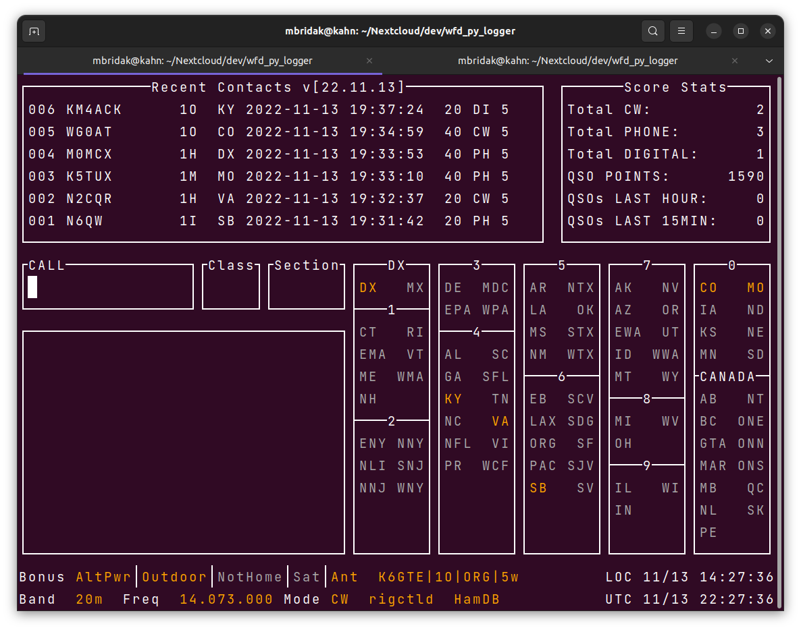
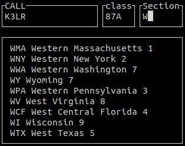
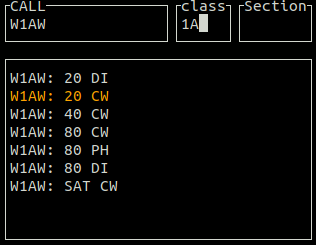

## K6GTE Winter Field Day logger (Curses)

The logger is written in Python 3, and uses the curses lib. It will work with Linux and Mac, but since the Windows curses lib is lacking it will not work properly in Windows. 

**A newer version based on PyQt5 can be found [here](https://github.com/mbridak/WinterFieldDayLogger)**.

The log is stored in an sqlite3 database file 'WFD_Curses.db'. If you need to wipe everything and start clean, just delete this file. The screen size expected by the program is an 80 x 24 character terminal. Nothing needs to be installed, compiled etc... Just make WFD_Curses.py executable and run it within the same folder.

I decided to write this after the 2018 Winter Field Day when I couldn't find a simple Linux logger for the event. I didn't need multiuser logging or GPS disciplined time servers. Just a simple logger with dup checking that could generate a cabrillo log for submission.



**A newer version based on PyQt5 can be found [here](https://github.com/mbridak/WinterFieldDayLogger)**.

## What going on in the development branch.

After 3+ years of neglect for the curses version, it's in need of some TLC. It's been one large monolithic chunk of code from the start. I've decided to break it into manageable chunks (classes). 

So far we have:

* cat_interface.py Abstraction class "CAT" for both rigctld and flrig.
* database.py well... does database stuff.
* lookup.py Abstraction class for QRZ, HamQTH and HamDB
* preferences.py Decided to move all the preferences from the sqlite table and into a json file. This makes it easier to edit for the user and straight forward  to load and save.

It will take awhile to bring all this into the program. But  it'll get there.

[Russ K5TUX](https://lhspodcast.info/) has made several pull requests with new features. Which to be honest, shamed me into looking at the code again, and seeing the absolute horror show the layers of cruft and years of neglect has brought.

## Caveats
This is a simple logger ment for single op, it's not usable for clubs.

**A newer version based on PyQt5 can be found [here](https://github.com/mbridak/WinterFieldDayLogger)**.

## Initial Setup
Before running you may want to edit the `wfd_preferences.json` file. It has settings for rigcontrol, callsign lookup and cloudlog integration.

## Commands:
Commands start with a period character in the callsign field and are immediately followed by any information needed by the command.

```
.H displays a short list of commands.
.Q Quit the program.
.Kyourcall Sets your callsign. .KK6GTE will set it to K6GTE.
.Cyourclass Sets your class. .C1O will set your class to 1O.
.Syoursection Sets your section. .SORG sets your section to ORG.
.P# Sets the power level, .P5 will set the power to 5 watts.
.MCW .MPH .MDI Sets the mode. CW Morse, PH Phone, DI Digital.
.B# sets the band, .B40 for 40 meters.
.D# Deletes log entry. .D26 will delete the log line starting with 026.
.E# Edits log entry. .E26 will edit the log line starting with 026.
.L Generate Cabrillo log file for submission.
.1 Claim Alt-Power Bonus
.2 Claim Outdoors Bonus
.3 Claim Away from Home Bonus
.4 Claim Satellite Bonus
[esc] abort input, clear all fields.
```

After the command is entered press the TAB key to execute it.

So when I initially start the program I would enter the following:

```
.KK6GTE
.C1O
.SORG
.P5
.B40
.MCW
``` 
This says I'm K6GTE 1O ORG, running 5 watts CW on 40 Meters.

For claimed bonuses, since I'll be using battery and solar and I'll be outdoors and away from home, but I don't plan on making any Satellite contacts I'd also enter the following.
```
.1
.2
.3
```

## Logging
Okay you've made a contact. Enter the call in the call field. As you type it in, it will do a super check partial (see below). Press TAB or SPACE to advance to the next field. Once the call is complete it will do a DUP check (see below). It will try and Autofill the next fields (see below). When entering the section, it will do a section partial check (see below). Press the ENTER key to submit the Q to the log. If it's a busted call or a dup, press the ESC key to clear all inputs and start again.

## Features

#### Radio Polling via rigctld or flrig
Be sure to edit the json file referenced in the Initial Setup section. Place a `1` next to your preferred CAT method. and fill in the CAT_ip and CAT_port fields.

##### flrig:

    "userigctld": 0,
    "useflrig": 1,
    "CAT_ip": "localhost",
    "CAT_port": 12345,

##### rigctld:

    "userigctld": 1,
    "useflrig": 0,
    "CAT_ip": "localhost",
    "CAT_port": 4532,

The radio will be polled for band/mode updates automatically. There is an indicator at the bottom of the logging window to indicate polling status. Dim if no connection or timeout, and highlighted if all okay.


#### QRZ, HamQTH, HamDB
If you are going to use a callsign lookup service, you can edit the lines in the wfd_preference.json shown below.

    "usehamdb": 0,
    "hamdburl": "https://api.hamdb.org",
    "useqrz": 0,
    "qrzusername": "",
    "qrzpassword": "",
    "qrzurl": "https://xmldata.qrz.com/xml/134",
    "usehamqth": 0,
    "hamqthusername": "",
    "hamqthpassword": "",
    "hamqthurl": "",

#### Cloudlog
If you wish to have your contacts pushed to cloudlog, edit the lines in the wfd_preference.json shown below.

    "cloudlog": 0,
    "cloudlogapi": "c01234567890123456789",
    "cloudlogurl": "https://www.cloudlog.com/Cloudlog/index.php/api",
    "cloudlogstationid": "",

#### Editing an existing contact
Use the Up/Down arrow keys or PageUp/PageDown to scroll the contact into view. Your mouse scroll wheel may work as well. Double left click on the contact to edit, or use the '.E' command. Use the TAB or Up/Down arrow keys to move between fields. Backspace to erase and retype what you need.
Once done press the Enter key to save, or the Escape key to exit.


#### Super Check Partial
If you type more than two characters in the callsign field the program will filter the input through a "Super Check Partial" routine and show you possible matches to known contesting call signs. Is this useful? Doubt it.


#### Section partial check
As you type the section abbreviation you are presented with a list of all possible sections that start with what you have typed.



#### DUP checking
Once you type a complete callsign and press TAB or SPACE to advance to the next field. The callsign is checked against previous callsigns in your log. It will list any prior contact made showing the band and mode of the contact. If the band and mode are the same as the one you are currently using, the listing will be highlighted, the screen will flash, a bell will sound to alert you that this is a DUP. At this point you and the other OP can argue back and forth about who's wrong. In the end you'll put your big boy pants on and make a decision if you'll enter the call or not.



#### Autofill
If you have worked this person before on another band/mode the program will load the class and section used previously for this call so you will not have to enter this info again.

## TODO
  * Enter a contact at a specific time.

Let me know if you think of something else.
